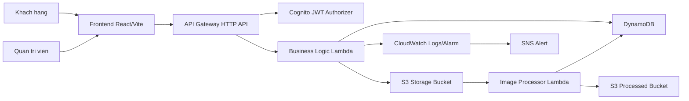

# Cloud Office - He thong quan ly cho thue van phong tren AWS

Cloud Office la nen tang quan ly va dat thue van phong theo mo hinh cloud-native. Du an tach rieng frontend va backend de de phat trien, de deploy, giam do nang khi cai them Node.js dependencies, va phu hop voi kien truc serverless tren AWS.

Giao dien public huong den khach hang can tim kiem, xem chi tiet va gui yeu cau thue van phong. Khu vuc admin tap trung vao quan tri du lieu, CRUD van phong, khach hang, hop dong, yeu cau thue, xu ly hinh anh va theo doi trang thai he thong.

## Diem noi bat

- Frontend doanh nghiep: React + TypeScript + Vite, landing page, danh sach van phong, chi tiet van phong, dang nhap, dang ky, ho so nguoi dung va admin dashboard.
- Backend serverless: AWS Lambda Node.js 22.x sau API Gateway HTTP API.
- Xac thuc: Amazon Cognito, JWT authorizer, phan quyen user/admin.
- Du lieu: DynamoDB single-table design cho office, customer, rental request va contract.
- Hinh anh: S3 bucket luu anh goc, Lambda xu ly anh, S3 bucket luu anh da toi uu.
- Giam sat: CloudWatch Logs, CloudWatch Alarm va SNS alert.
- Deploy thuc te: AWS SAM cho backend, S3/CloudFront cho frontend.

## Kien truc tong quan



## Cau truc thu muc

```text
cloudoffice/
  frontend/                 # React + TypeScript + Vite
  backend/                  # AWS SAM, Lambda source, seed data
    infra/template.yaml     # Khai bao ha tang AWS
    functions/
      business-logic/       # API chinh, CRUD, auth, S3 presigned URL
      image-processor/      # Xu ly anh office tu S3
  docs/
    00-huong-dan-chay-va-deploy-tu-a-den-z.md
  README.md
```

## Tech stack

| Lop | Cong nghe |
| --- | --- |
| Frontend | React 18, TypeScript, Vite |
| Backend | Node.js 22.x, AWS Lambda, AWS SAM |
| API | Amazon API Gateway HTTP API |
| Auth | Amazon Cognito |
| Database | Amazon DynamoDB |
| Storage | Amazon S3 |
| Image processing | Lambda + sharp |
| Monitoring | Amazon CloudWatch, SNS |
| Deployment | AWS SAM, S3, CloudFront |

## Chuan bi moi truong

Can cai truoc:

- Node.js 22.x
- npm
- AWS CLI v2
- AWS SAM CLI
- Docker Desktop neu muon test local Lambda/SAM day du
- Tai khoan AWS da cau hinh quyen cho CloudFormation, Lambda, API Gateway, DynamoDB, S3, Cognito, IAM, CloudWatch, SNS va CloudFront

Kiem tra phien ban:

```powershell
# Kiem tra Node.js, nen la 22.x
node -v

# Kiem tra npm
npm -v

# Kiem tra AWS CLI
aws --version

# Kiem tra AWS SAM CLI
sam --version
```

Cau hinh AWS CLI:

```powershell
# Cau hinh access key, secret key, region va output format
aws configure

# Gia tri goi y
# AWS Access Key ID: <access-key-cua-ban>
# AWS Secret Access Key: <secret-key-cua-ban>
# Default region name: ap-southeast-1
# Default output format: json
```

Kiem tra dang nhap AWS:

```powershell
# Neu lenh nay tra ve Account, Arn, UserId la AWS CLI da san sang
aws sts get-caller-identity
```

## Cai dat du an lan dau

Chay tu thu muc goc:

```powershell
cd D:\THUCTAPTT\cloudoffice

# Cai dependencies frontend
npm run frontend:install

# Cai dependencies backend cho tung Lambda function
npm run backend:install
```

Co the cai rieng tung phan neu chi lam frontend hoac backend:

```powershell
# Chi cai frontend
npm install --prefix frontend

# Chi cai backend
npm --prefix backend run install:all
```

## Chay frontend local

Tao file `frontend/.env`:

```env
VITE_API_BASE_URL=https://<api-id>.execute-api.ap-southeast-1.amazonaws.com
VITE_COGNITO_USER_POOL_ID=<cognito-user-pool-id>
VITE_COGNITO_CLIENT_ID=<cognito-client-id>
VITE_USE_DEMO_FALLBACK=false
```

Chay frontend:

```powershell
cd D:\THUCTAPTT\cloudoffice
npm run frontend:dev
```

Mac dinh Vite se chay tai:

```text
http://localhost:5173
```

## Build backend

```powershell
cd D:\THUCTAPTT\cloudoffice\backend

# Build SAM template va Lambda artifacts
sam build --config-file samconfig.toml --no-cached
```

## Deploy backend len AWS

Neu day la lan deploy dau tien:

```powershell
cd D:\THUCTAPTT\cloudoffice\backend
sam deploy --guided
```

Gia tri goi y:

```text
Stack Name: cloffice-backend
AWS Region: ap-southeast-1
Confirm changes before deploy: Y
Allow SAM CLI IAM role creation: Y
Disable rollback: N
EnableCloudFront: false
```

Ghi chu: neu tai khoan AWS chua duoc phe duyet CloudFront, hay de `EnableCloudFront=false`. Sau khi AWS phe duyet CloudFront, co the deploy lai voi `EnableCloudFront=true`.

Neu da co `samconfig.toml`:

```powershell
cd D:\THUCTAPTT\cloudoffice\backend
sam build --config-file samconfig.toml --no-cached
sam deploy --config-file samconfig.toml --template-file .aws-sam/build/template.yaml
```

Lay output sau khi deploy:

```powershell
aws cloudformation describe-stacks `
  --stack-name cloffice-backend `
  --region ap-southeast-1 `
  --query "Stacks[0].Outputs"
```

Can lay cac gia tri sau de cau hinh frontend:

- `ApiUrl`
- `CognitoUserPoolId`
- `CognitoClientId`
- `FrontendBucketName`
- `StorageBucketName`
- `ProcessedBucketName`
- `CloudFrontDistributionId` neu bat CloudFront

## Seed du lieu mau

Seed len DynamoDB tren AWS:

```powershell
cd D:\THUCTAPTT\cloudoffice\backend
npm run seed -- --table cloffice-offices-table --region ap-southeast-1
```

Seed local voi DynamoDB Local:

```powershell
cd D:\THUCTAPTT\cloudoffice\backend
npm run seed:local
```

## Build va deploy frontend

Build frontend:

```powershell
cd D:\THUCTAPTT\cloudoffice
npm run frontend:build
```

Upload frontend len S3:

```powershell
aws s3 sync frontend/dist s3://<FrontendBucketName> --delete
```

Neu da co CloudFront:

```powershell
aws cloudfront create-invalidation `
  --distribution-id <CloudFrontDistributionId> `
  --paths "/*"
```

## Tao user admin Cognito

Tao user admin bang AWS CLI:

```powershell
aws cognito-idp admin-create-user `
  --user-pool-id <CognitoUserPoolId> `
  --username admin@example.com `
  --user-attributes Name=email,Value=admin@example.com Name=email_verified,Value=true `
  --region ap-southeast-1
```

Dat mat khau vinh vien de tranh trang thai `FORCE_CHANGE_PASSWORD`:

```powershell
aws cognito-idp admin-set-user-password `
  --user-pool-id <CognitoUserPoolId> `
  --username admin@example.com `
  --password "Password123!" `
  --permanent `
  --region ap-southeast-1
```

Them user vao group admin:

```powershell
aws cognito-idp admin-add-user-to-group `
  --user-pool-id <CognitoUserPoolId> `
  --username admin@example.com `
  --group-name admin `
  --region ap-southeast-1
```

## Xoa moi truong AWS de tranh chi phi

Neu chi test va muon xoa toan bo stack:

```powershell
# Xoa file trong cac bucket truoc neu CloudFormation bao bucket khong rong
aws s3 rm s3://<FrontendBucketName> --recursive
aws s3 rm s3://<StorageBucketName> --recursive
aws s3 rm s3://<ProcessedBucketName> --recursive

# Xoa stack backend
cd D:\THUCTAPTT\cloudoffice\backend
sam delete --stack-name cloffice-backend --region ap-southeast-1
```

Neu Cognito duoc tao trong stack SAM, lenh `sam delete` se xoa luon Cognito User Pool. Chi xoa Cognito rieng khi ban tao Cognito thu cong tren AWS Console.

## Tai lieu chi tiet

Huong dan day du tu A den Z nam tai:

[docs/00-huong-dan-chay-va-deploy-tu-a-den-z.md](docs/00-huong-dan-chay-va-deploy-tu-a-den-z.md)

Tong hop cac chuc nang backend moi, migration DynamoDB, lich hen, upload S3, canh bao hop dong va WAF tuy chon:

[docs/11-tong-hop-trien-khai-chuc-nang-backend.md](docs/11-tong-hop-trien-khai-chuc-nang-backend.md)

Huong dan deploy AWS theo tung giai doan, CloudFront va WAF tuy chon:

[docs/12-huong-dan-deploy-du-an-aws.md](docs/12-huong-dan-deploy-du-an-aws.md)

Nen doc file nay khi can deploy that, xu ly loi CORS, Cognito, CloudFront, seed DynamoDB hoac upload hinh anh len S3.

## Trang thai khuyen nghi khi phat trien

- Chay frontend local o `http://localhost:5173`.
- Backend co the deploy tren AWS de test API that voi DynamoDB, Cognito va S3.
- Chua bat CloudFront neu tai khoan AWS chua duoc verify.
- Dung Node.js 22.x cho ca frontend va backend de tranh rui ro runtime Lambda Node.js cu bi ngung ho tro.
# cloudeoffice_sibachao
